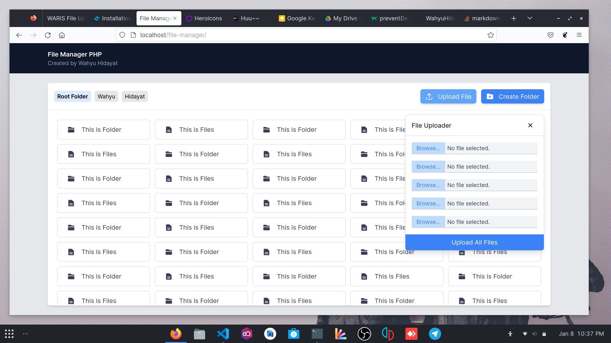
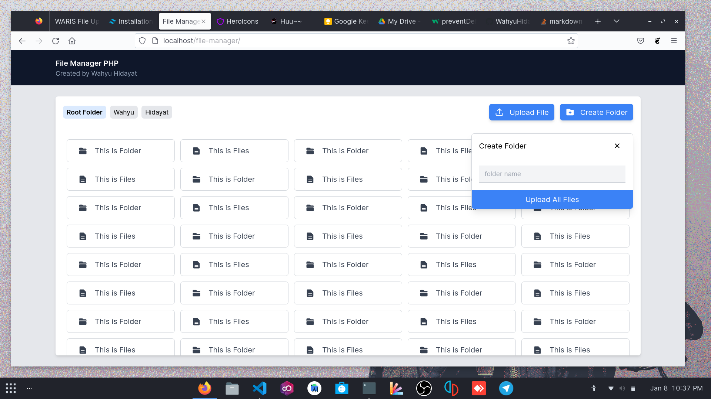

# PHP File Manager

This is a native PHP file manager

what the feature of this :

- simple

- clean

- light

- base

how to install :

1. Clone this repo

2. Call it into brwser ex. http://yourdomain/file-manager

3. Enjoy it :D

Composition for made it :

1. PHP Native ofc,

2. HTML

3. Javascript (Only basic DOM)

4. Tailwindcss (Im pro in tailwindcss 😎)

Screenshot :

