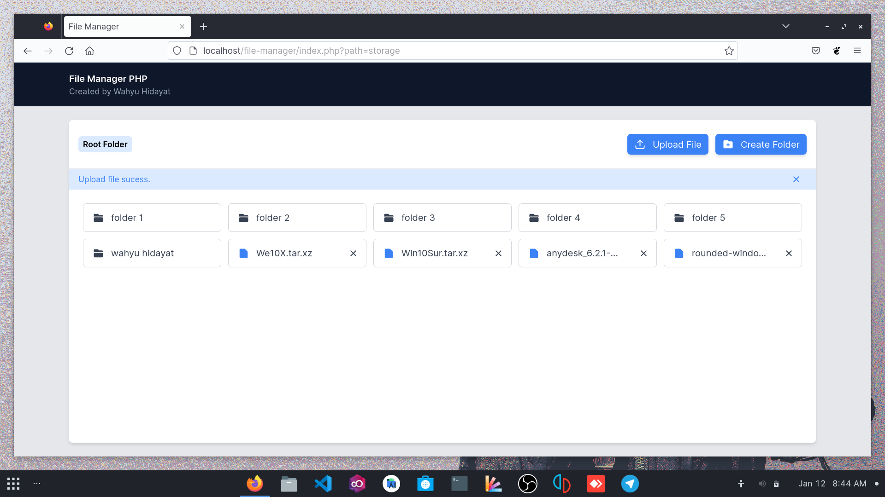
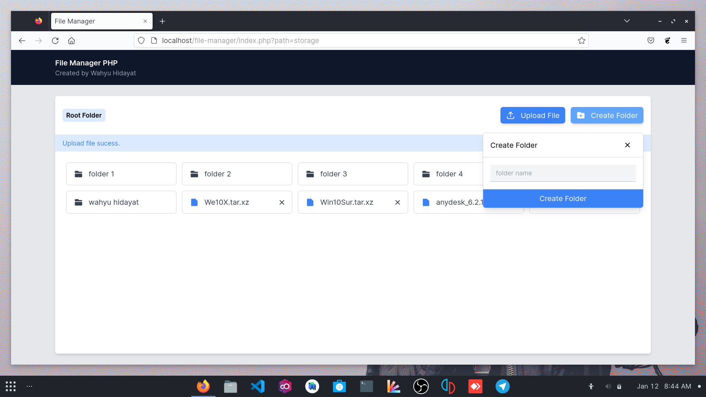
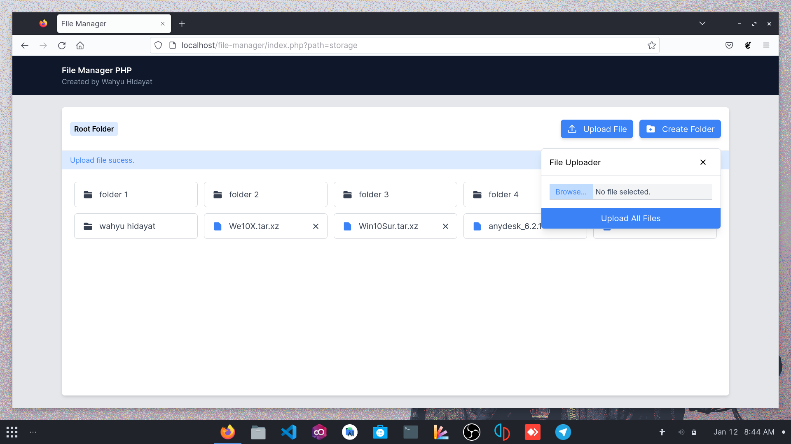

# PHP File Manager

This is a native PHP file manager

what the feature of this :

- simple

- clean

- light

- base

how to install :

1. Clone this repo

2. Call it into brwser ex. http://yourdomain/file-manager

3. Enjoy it :D

Screenshot :

